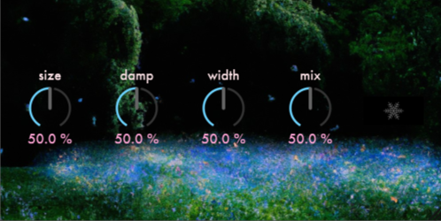

# HayesReverb
A simple reverb audio plug-in written in JUCE. It interacts with the juce::dsp reverb processor provided by the framework.
The user can control the size, the damp-ness, width, and mix of the reverb in their signal, plus a freeze switch for emulating
a sustain stompbox.

